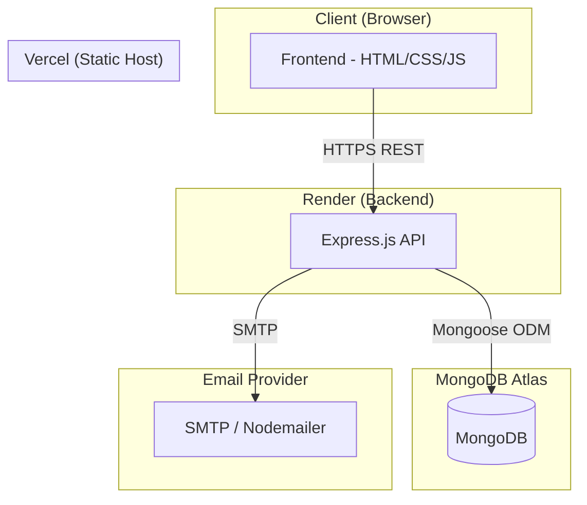

# Design Document: Personal Portfolio

## Overview

A full-stack personal portfolio website with a static frontend and a REST API backend. Visitors can browse projects, skills, and send contact messages. The Admin can authenticate and manage content via protected API endpoints.

**Tech Stack**
- Frontend: HTML, CSS, vanilla JavaScript (static files)
- Backend: Node.js + Express.js
- Database: MongoDB via Mongoose (hosted on MongoDB Atlas)
- Auth: JWT (jsonwebtoken) + bcrypt password hashing
- Email: Nodemailer (SMTP)
- Deployment: Vercel (frontend), Render (backend)

---

## Architecture



Request flow:
1. Browser loads static assets from Vercel CDN.
2. JavaScript fetches data from the Express API over HTTPS.
3. Protected write endpoints require a JWT in the `Authorization: Bearer <token>` header.
4. The API reads/writes MongoDB Atlas via Mongoose.
5. On contact form submission the API sends an email via Nodemailer.

---

## Components and Interfaces

### Frontend Pages / Sections

| Section | File | Responsibility |
|---|---|---|
| Home | `index.html` | Bio, photo, nav links |
| Projects | `projects.html` or section | Fetch + render project cards |
| Skills | `skills.html` or section | Fetch + render skill groups |
| Contact | `contact.html` or section | Form, client-side validation, POST submission |
| Admin Login | `admin/login.html` | Credential form, store JWT in localStorage |
| Admin Dashboard | `admin/dashboard.html` | CRUD UI for projects and skills |

### Backend Modules

```
src/
  app.js            – Express app setup, middleware, routes
  server.js         – HTTP server entry point, DB connect
  config/
    db.js           – Mongoose connection
    env.js          – Environment variable validation
  models/
    Project.js
    Skill.js
    Admin.js
  routes/
    auth.js         – POST /api/auth/login
    projects.js     – CRUD /api/projects
    skills.js       – GET /api/skills (+ protected write routes)
    contact.js      – POST /api/contact
  middleware/
    auth.js         – JWT verification middleware
    validate.js     – Request body validation helpers
  services/
    email.js        – Nodemailer send helper
```

### API Endpoints

#### Auth
| Method | Path | Auth | Description |
|---|---|---|---|
| POST | `/api/auth/login` | — | Returns signed JWT |

#### Projects
| Method | Path | Auth | Description |
|---|---|---|---|
| GET | `/api/projects` | — | List all projects |
| GET | `/api/projects/:id` | — | Single project |
| POST | `/api/projects` | JWT | Create project |
| PUT | `/api/projects/:id` | JWT | Update project |
| DELETE | `/api/projects/:id` | JWT | Delete project |

#### Skills
| Method | Path | Auth | Description |
|---|---|---|---|
| GET | `/api/skills` | — | List all skills |
| POST | `/api/skills` | JWT | Create skill |
| PUT | `/api/skills/:id` | JWT | Update skill |
| DELETE | `/api/skills/:id` | JWT | Delete skill |

#### Contact
| Method | Path | Auth | Description |
|---|---|---|---|
| POST | `/api/contact` | — | Submit contact message, send email |

---

## Data Models

### Project (Mongoose Schema)

```js
{
  _id:         ObjectId,          // auto-generated
  title:       String,  required,
  description: String,  required,
  tech_stack:  [String],          // e.g. ["React", "Node.js"]
  demo_url:    String,            // optional
  repo_url:    String,            // optional
  image_url:   String,            // optional; frontend shows placeholder when absent
  created_at:  Date,    default: Date.now
}
```

### Skill (Mongoose Schema)

```js
{
  _id:        ObjectId,
  name:       String, required,
  category:   String, required,   // e.g. "Frontend", "Backend", "DevOps"
  proficiency: String, required,  // e.g. "Beginner" | "Intermediate" | "Expert"
}
```

### Admin (Mongoose Schema)

```js
{
  _id:           ObjectId,
  email:         String, required, unique,
  password_hash: String, required   // bcrypt hash; plaintext never stored
}
```

### Contact Message (in-memory / email only)

The contact submission is not persisted in the database; it is forwarded to the Admin via Nodemailer immediately. The validated payload shape is:

```js
{
  name:    String, required,
  email:   String, required, valid email format,
  message: String, required
}
```

---


## Correctness Properties

*A property is a characteristic or behavior that should hold true across all valid executions of a system — essentially, a formal statement about what the system should do. Properties serve as the bridge between human-readable specifications and machine-verifiable correctness guarantees.*

### Property 1: Project card render completeness

*For any* project object with title, description, tech_stack array, and at least one link, the frontend render function should produce HTML that contains the title text, description text, each tech stack tag, and at least one anchor element.

**Validates: Requirements 2.4**

---

### Property 2: Project CRUD round-trip

*For any* valid project payload (non-empty title and description, arbitrary optional fields), creating it via POST `/api/projects` and then reading it back via GET `/api/projects/:id` should return an object with identical field values for title, description, tech_stack, demo_url, repo_url, and image_url.

**Validates: Requirements 2.2, 3.1, 3.2**

---

### Property 3: Missing required field returns 400

*For any* project creation request where title or description is absent or empty, the API should respond with HTTP 400 and a body containing a non-empty `error` or `message` string.

**Validates: Requirements 3.3**

---

### Property 4: Non-existent project ID returns 404

*For any* ObjectId that does not correspond to a project in the database, GET, PUT, and DELETE requests to `/api/projects/:id` should all return HTTP 404.

**Validates: Requirements 3.4**

---

### Property 5: Skills grouping and field completeness

*For any* list of skills stored in the database, the GET `/api/skills` response should include every skill with name, category, and proficiency fields present and non-empty; and the frontend render function should produce one group container per distinct category value, with each skill appearing in the correct group.

**Validates: Requirements 4.1, 4.2, 4.3**

---

### Property 6: Contact form rejects invalid input client-side

*For any* form submission where at least one of name, email, or message is empty — or where email does not match a valid email format — the frontend validation function should return at least one error message and should not invoke the API fetch.

**Validates: Requirements 5.3**

---

### Property 7: Valid contact submission succeeds and triggers email

*For any* valid contact payload (non-empty name, valid email, non-empty message), POST `/api/contact` should return HTTP 200 and the email transport's `send` method should be called exactly once with the Admin's configured address as the recipient.

**Validates: Requirements 5.2, 5.4**

---

### Property 8: Valid credentials return a signed JWT

*For any* Admin credential pair where the email matches a stored admin and the password matches the stored hash, POST `/api/auth/login` should return HTTP 200 with a response body containing a `token` field that is a verifiable JWT signed with the application secret.

**Validates: Requirements 6.1**

---

### Property 9: Invalid credentials return 401 and no token

*For any* credential pair where either the email is not in the database or the password does not match the stored hash, POST `/api/auth/login` should return HTTP 401 and the response body should not contain a `token` field.

**Validates: Requirements 6.2**

---

### Property 10: JWT auth middleware enforces access

*For any* protected endpoint (POST/PUT/DELETE on projects or skills), a request bearing a valid, unexpired JWT signed with the application secret should receive a 2xx response; and a request with no token, an expired token, or a tampered token should receive HTTP 401.

**Validates: Requirements 6.3, 6.4**

---

### Property 11: Passwords stored as hashes

*For any* Admin document retrieved directly from the database after creation, the `password_hash` field should not equal the plaintext password supplied during creation, and `bcrypt.compare(plaintext, password_hash)` should return true.

**Validates: Requirements 6.5**

---

## Error Handling

### API Layer

| Scenario | HTTP Status | Response Body |
|---|---|---|
| Missing required field (project/skill) | 400 | `{ "error": "<field> is required" }` |
| Resource not found | 404 | `{ "error": "Not found" }` |
| Invalid / missing JWT | 401 | `{ "error": "Unauthorized" }` |
| Wrong login credentials | 401 | `{ "error": "Invalid credentials" }` |
| DB connection failure at startup | — | Log error + `process.exit(1)` |
| Nodemailer send failure | 500 | `{ "error": "Email could not be sent" }` |
| Unhandled server error | 500 | `{ "error": "Internal server error" }` |

All error responses follow the shape `{ "error": string }` for consistency.

### Frontend Layer

- Network errors on fetch: display a user-facing message ("Could not load projects. Please try again later.").
- Contact form submission failure: display inline error without clearing the form.
- Admin login failure: display the API error message below the form.
- Missing project image: `onerror` handler on `` swaps `src` to a local placeholder.

---

## Testing Strategy

### Dual Testing Approach

Both unit tests and property-based tests are required and complementary:

- **Unit tests** cover specific examples, integration points, and error conditions that are hard to express as universal properties.
- **Property-based tests** verify universal properties across many randomly generated inputs.

### Property-Based Testing

Use **fast-check** (JavaScript) for all property tests.

Each property test must:
- Run a minimum of 100 iterations (`numRuns: 100` or higher).
- Include a comment tag in the format: `// Feature: personal-portfolio, Property <N>: <property_text>`

Property-to-test mapping:

| Property | Test target | fast-check arbitraries |
|---|---|---|
| P1 – Project render completeness | `renderProjectCard(project)` | `fc.record({ title: fc.string(), description: fc.string(), tech_stack: fc.array(fc.string()), ... })` |
| P2 – CRUD round-trip | Integration: POST → GET | `fc.record({ title: fc.string({minLength:1}), description: fc.string({minLength:1}), ... })` |
| P3 – Missing field → 400 | `POST /api/projects` | `fc.record` with title or description omitted |
| P4 – Non-existent ID → 404 | `GET/PUT/DELETE /api/projects/:id` | `fc.hexaString({minLength:24, maxLength:24})` (random ObjectId-like) |
| P5 – Skills grouping | `renderSkillsSection(skills)` + `GET /api/skills` | `fc.array(fc.record({ name, category, proficiency }))` |
| P6 – Contact validation | `validateContactForm(data)` | `fc.record` with at least one empty/invalid field |
| P7 – Contact submission | Integration: `POST /api/contact` with mocked mailer | `fc.record({ name: fc.string({minLength:1}), email: fc.emailAddress(), message: fc.string({minLength:1}) })` |
| P8 – Valid login → JWT | Integration: `POST /api/auth/login` | `fc.emailAddress()` + `fc.string({minLength:8})` for seeded admin |
| P9 – Invalid login → 401 | Integration: `POST /api/auth/login` | arbitrary email/password pairs not matching seeded admin |
| P10 – JWT middleware | Integration: protected routes | generate valid + mutated tokens |
| P11 – Password hashing | `Admin.create()` → DB read | `fc.string({minLength:8})` |

### Unit Tests

Focus areas:
- Specific examples: a project with all fields, a project with no image renders placeholder (``).
- Edge cases: empty tech_stack array, very long description string.
- Integration points: Mongoose connection failure triggers `process.exit(1)` with log output (mock `mongoose.connect`).
- Email send failure returns 500.

### Test Organization

```
tests/
  unit/
    renderProjectCard.test.js
    renderSkillsSection.test.js
    validateContactForm.test.js
  integration/
    projects.api.test.js
    skills.api.test.js
    contact.api.test.js
    auth.api.test.js
  property/
    projects.prop.test.js    – P1, P2, P3, P4
    skills.prop.test.js      – P5
    contact.prop.test.js     – P6, P7
    auth.prop.test.js        – P8, P9, P10, P11
```

Test runner: **Jest** with `--runInBand` for integration tests (shared DB state).
Test database: in-memory MongoDB via `mongodb-memory-server`.
